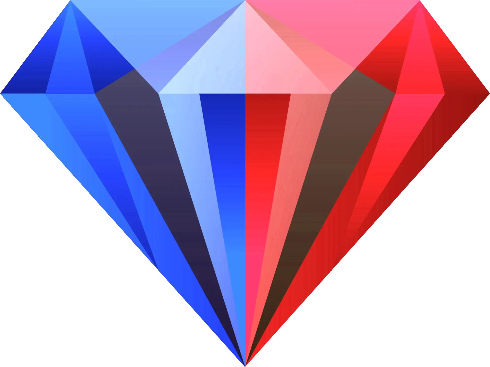

<table border="0">
  <tr>
    <td align="center" valign="middle">
      
    </td>
    <td valign="middle" style="padding-left: 20px;">
      <h1>LyricsTranslate Tool</h1>
      <p><strong>Argel H's Lyrics Translation Editor</strong> – simplify your <i>music video</i> translation workflow.</p>
    </td>
  </tr>
</table>

## Quick Start

```bash
npm install
npm run dev
```

## Tech Stack

| Layer | Technology |
|---|---|
| Frontend | React 19 + TypeScript (strict) |
| Build | Vite 8 |
| UI | Tailwind CSS 3 + shadcn/ui |
| State | Zustand |
| Persistence | Dexie.js (IndexedDB) |
| Routing | react-router-dom v7 |
| Icons | lucide-react + Material Symbols |
| i18n | Custom key-value (en, es, pt) |

## Features

- Search songs via LRCLIB and auto-fill metadata from Deezer, MusicBrainz, and Odesli
- Manual project creation with dynamic artists and social media links
- Editable lyric/translation table with timestamp controls
- Circular Tab navigation between rows (wraps last→first, first→last)
- Editor keyboard shortcuts (play/pause, seek, line navigation, quick edit)
- Export to LRC and SRT (original or translated)
- Translation progress indicator
- AI auto-translation (Google Gemini / DeepSeek)
- Row locking and overwrite control
- Translation suggestions with keyboard cycling
- Share projects via short links (QR code + 30-day history), with read-only and import-preview pages
- Project status workflow, status filters, and archive/unarchive
- Database backup and restore (whole-library import/export)
- Language flags with random-order rotation for multi-region languages
- 3D parallax tilt on cover art and diacritic-insensitive search
- Tabbed settings modal (General / AI Translation)
- 3 languages (English, Spanish, Portuguese)

## API Services

| Service | Purpose |
|---|---|
| LRCLIB | Synced/plain lyrics search |
| MusicBrainz | ISRC lookup, artist social media links |
| Deezer | Cover art, album name, artist list, artist links |
| Odesli/Song.link | Streaming platform links |
| Google Gemini / DeepSeek | AI auto-translation of lyrics |
| Cloudflare Worker + KV | Metadata proxy and short-link share storage |

In development, external services are accessed through Vite dev-server proxies to avoid CORS; sharing talks directly to the Cloudflare Worker in both dev and production.

## Project Structure

```
src/
  types/          Shared interfaces (project, share, music, yaml)
  services/       API clients (LRCLIB, MusicBrainz, Deezer, Odesli, SimplyTranslate)
  db/             Dexie.js schema and repositories (projects, share records, settings)
  stores/         Zustand stores
  i18n/           Translation strings
  hooks/          useDebounce, useI18n, usePageShell, useRotatingIndex, useSharedProjectLoader, ...
  lib/            Utilities, parsers, flags
    config/       aiConfig, apiConfig, appConfig, constants
    share/        Binary share protocol, Brotli compression, base64url, KV client, transcoder
  components/ui/  shadcn primitives
  components/shared/ ConfirmDialog, MessageModal, LoadingOverlay, LanguageLabel, RotatingFlag, ...
  features/
    shell/        AppShell, Sidebar, TopBar, MasterCard, Modal
    dashboard/    Search, project cards, hero section, all-projects page
    editor/       Lyric table, time controls, export, share dialog, shared/view-only pages
    project-setup/ Form, dropdowns, social media
```

## Routes

| Route | Page |
|---|---|
| `/` | Dashboard |
| `/projects` | All Projects (search, status filters, archive) |
| `/new-project` | Project Setup |
| `/edit-project/:id` | Edit Project |
| `/editor/:id` | Translation Editor |
| `/s/:data` | Shared project preview (import or view-only) |
| `/view/:data` | Read-only shared project |
